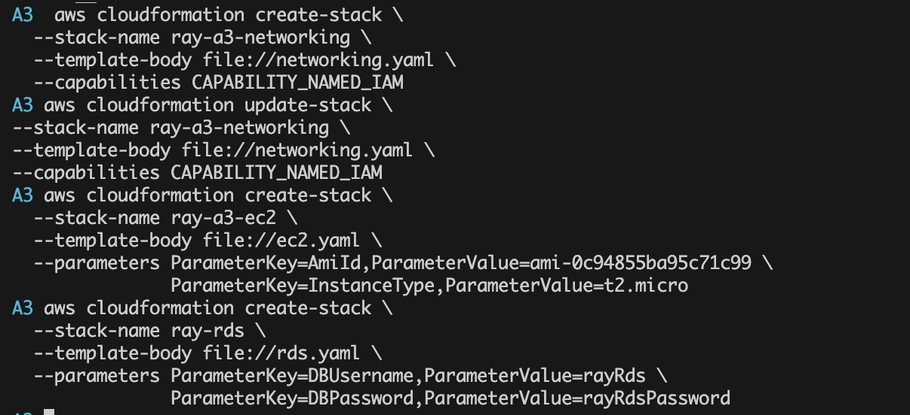

# Assignment 3: RDS MySQL Instance Setup

This repository contains the CloudFormation template for deploying an RDS MySQL instance on AWS. Below are the screenshots documenting each step of the deployment process.

---

## 1. AWS CLI Deployment

_Description:_  
Shows the use of AWS CLI to deploy CloudFormation stacks for networking, EC2, and RDS resources.

---

## 2. CloudFormation Stacks Overview

_Description:_  
Displays the CloudFormation console with all deployed stacks for networking, EC2, and RDS.

---

## 3. Networking Stack Outputs

_Description:_  
Shows the output values (VPC ID, Subnet IDs) from the networking stack, used for EC2 and RDS configuration.

---

## 4. VPC, Subnet, and Internet Gateway

_Description:_  
Displays the created VPC, public subnets, and attached Internet Gateway.

---

## 5. EC2 Instance Details

_Description:_  
Shows the deployed EC2 instance, including instance ID, public IP, and security group.

---

## 6. RDS Instance Details

_Description:_  
Displays the RDS MySQL instance, endpoint, and configuration.

---

**Note:**  
All screenshots are located in the `./screenshots/` directory.
